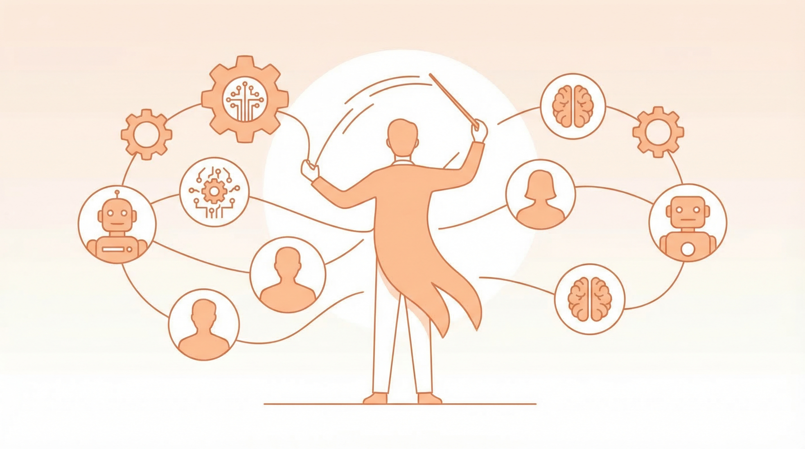

最近看到一堆前端团队解散、裁员的消息。

说实话，没太多情绪波动。反而有点「迟早会发生」的感觉。

## 资本的本质是算账

当一部分工作可以被更低成本、更高频率地完成时，结构一定会被重写。

这不是对错问题，是数学问题。

## 我自己的体感

上周五直接累倒了。连续一个月高强度，顶着做。

同一时间，AI 在那边 7×24 跑任务。

不会累。不会情绪波动。不会请假。不需要管理情绪、协调时间、等反馈。

你说它做得完美吗？不完美。

但它不停。

## 问题不在「能不能用」

现在的问题甚至已经不在「AI 能不能用」了。

而在于：**性价比开始变得越来越清晰**。

是的，AI 做出来的东西有时候还糙。

但你一旦拉长时间轴去看，它的成长速度远远不是线性的。

今天看起来是「能用但不稳」。

很可能过一段时间就是「稳定且更便宜」。

## 临界点

很多岗位真正的压力，不来自今天的 AI。

而来自未来某一个节点——

当「还不错 + 很便宜 + 随时可用」这三件事**同时成立**。

那一刻，结构就会被重新定价。

不是「被替代」那么简单。

是整个成本结构、协作方式、管理模式都要重写。

## 给管理者的思考

如果你是管理者，现在要想的不是「AI 会不会取代我的团队」。

而是：

- **管理的对象变了**。以前管人，现在可能要管「人 + AI」混合团队。
- **效率的定义变了**。以前看人效，现在要看「人 + AI」的整体产出。
- **角色在转变**。执行者变少，编排者变多。会用 AI 的人和不会用的人，差距会越来越大。

## 不是贩卖焦虑

写这些不是为了贩卖焦虑。

只是冷静地看一个正在发生的事实：

技术在变，成本结构在变，组织形态也会跟着变。

与其等着被动调整，不如主动想想：

**在这个变化里，我的位置在哪？**
