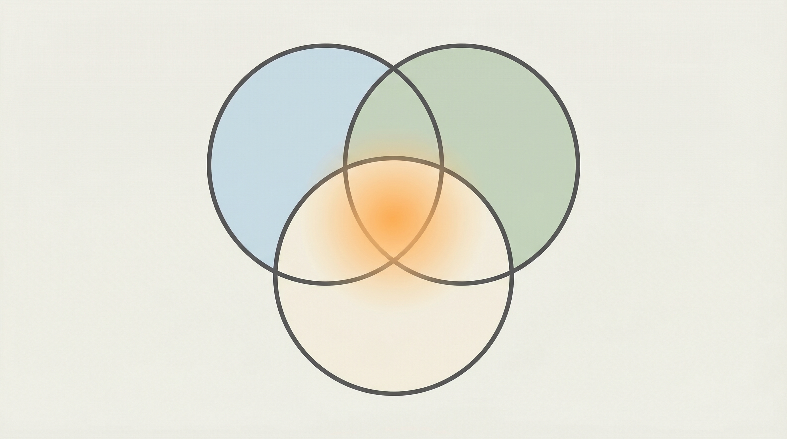

I've been seeing news about frontend teams being dissolved and laid off everywhere lately.

Honestly, I didn't feel much emotional turbulence. More like a sense of "this was bound to happen."

## Capital Is About Math

When part of the work can be done at lower cost and higher frequency, the structure will inevitably be rewritten.

This isn't about right or wrong. It's about math.

## My Personal Experience

Last Friday, I collapsed from exhaustion. A month of intense, non-stop work.

Meanwhile, AI was running tasks 24/7.

It doesn't get tired. It doesn't have mood swings. It doesn't take sick days. It doesn't need emotional management, schedule coordination, or feedback cycles.

Is its output perfect? No.

But it doesn't stop.

## The Question Is No Longer "Can It Be Used"

The question now isn't even "can AI be used anymore."

It's that **the cost-benefit is becoming increasingly clear**.

Yes, AI output can still be rough sometimes.

But if you zoom out on the timeline, its growth rate is far from linear.

What looks like "usable but unstable" today

might soon become "stable and cheaper."

## The Tipping Point

The real pressure on many roles doesn't come from today's AI.

It comes from a future tipping point—

When "good enough + cheap + always available" **all become true at once**.

At that moment, the entire structure gets repriced.

It's not just about "being replaced."

It's about the entire cost structure, collaboration model, and management paradigm being rewritten.

## Thoughts for Managers

If you're a manager, the question isn't "will AI replace my team."

It's:

- **What you manage has changed.** You used to manage people. Now you might manage "human + AI" hybrid teams.
- **The definition of efficiency has changed.** You used to measure human productivity. Now you need to measure "human + AI" output as a whole.
- **Roles are transforming.** Fewer executors, more orchestrators. The gap between those who can use AI and those who can't will only widen.

## This Isn't Fear-Mongering

I'm not writing this to spread anxiety.

Just observing a fact that's unfolding:

Technology is changing. Cost structures are changing. Organizational forms will change too.

Instead of waiting to be forced to adapt, why not think proactively:

**Where is my place in this shift?**
