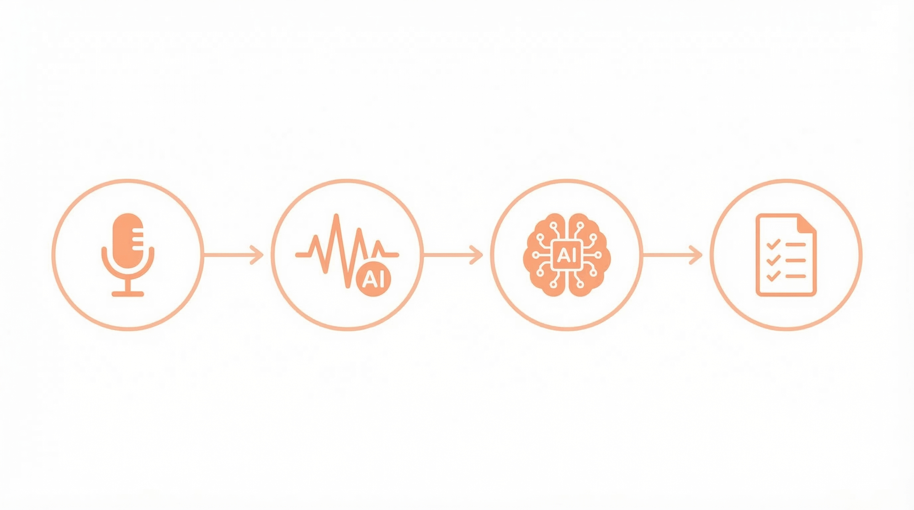
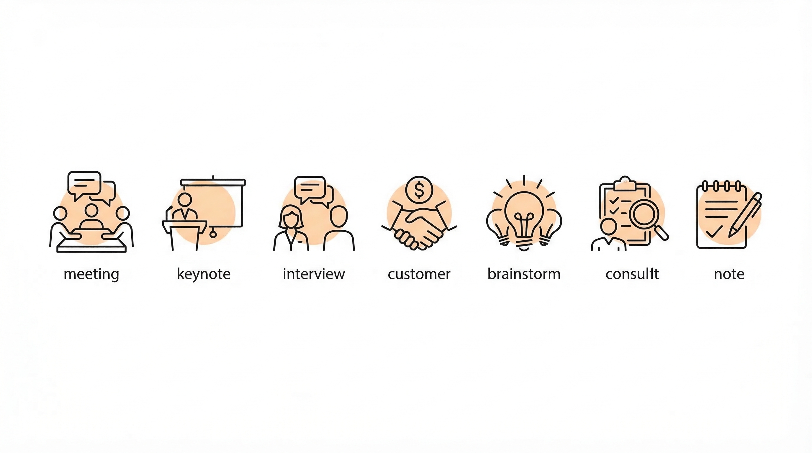
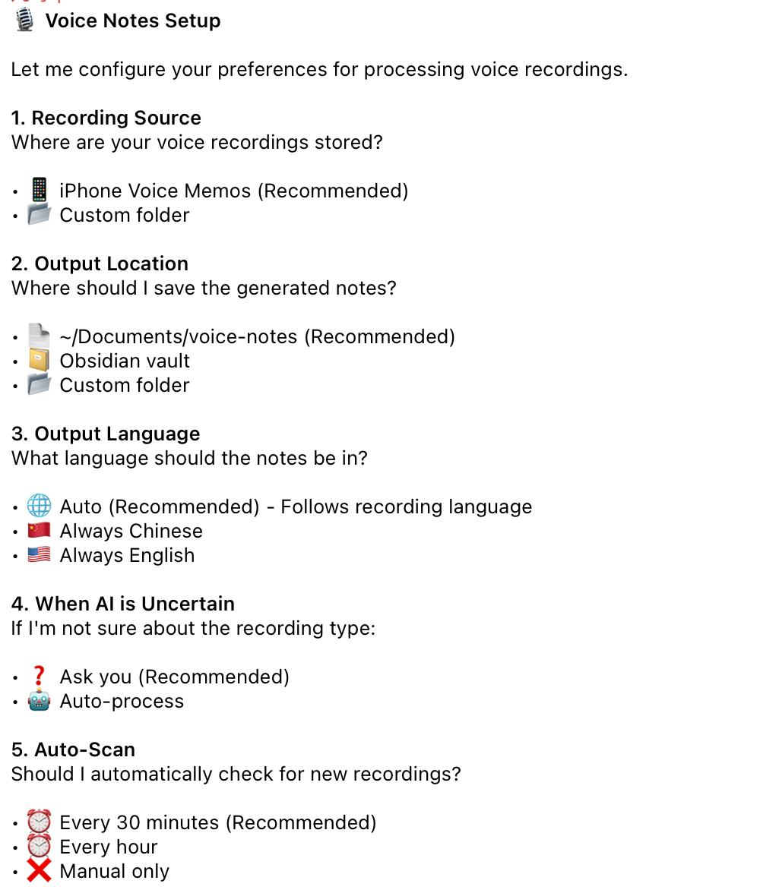
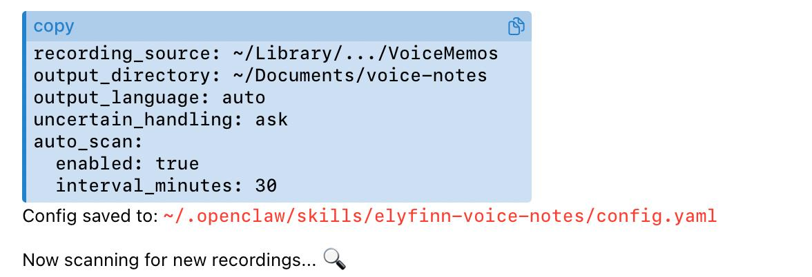

> **一句话总结**
> 
> 用手机自带的语音备忘录 + OpenClaw，实现「录音 → 自动转录 → 智能分类 → 结构化笔记」全流程自动化。
> 
> - 💰 **省钱**：0 元硬件 + 0 订阅（vs 竞品三年 6000+）
> - 🔒 **隐私**：数据 100% 在本地
> - 🧠 **智能**：7 种录音类型自动识别，不同类型不同模板
> - 🍎 **Apple 全家桶友好**：iPhone 录音自动同步到 Mac 处理

## 录音的终点，不该是吃灰

你有没有这样的经历？

开完一小时的会，录音是录了，但：
- 回去根本不想听第二遍
- 转成文字还是一大坨，找重点累死
- 「这个谁负责来着？deadline 是哪天？」翻半天找不到
- 最后录音躺在手机里，永远不会再打开

听完一场精彩的演讲：
- 当时觉得「太有道理了！」
- 过两天问你讲了啥，一脸懵
- 想找那句金句？在 45 分钟录音的某个角落里

**录音不是问题。录完没人整理，才是问题。**

## 市面上的解决方案：贵，而且数据不是你的

钉钉 A1 录音卡（499-799 元）、飞书录音豆（899 元）、Plaud Note（约 1000 元 + **每年 1700 元订阅**）……

这些设备确实能 AI 转录 + 智能总结。但我研究完，有几个点让我下不了手：

**又多一个设备。** 手机、充电宝、耳机……包里已经够乱了，再加个录音卡？

**数据全在云端。** 你的会议内容、客户对话、面试录音，都躺在厂商服务器上。

**订阅费真的贵。** Plaud 一年 1700，用三年就是一台 iPhone 了。

**生态绑定。** 钉钉录音卡只能配钉钉，飞书的只能配飞书。换个工具？数据带不走。

## 我的方案：0 元硬件 + 0 订阅 + 数据全在本地

我用 OpenClaw 搭了一套全自动流程：

> **手机录音 → 自动同步到电脑 → AI 转录 → 智能识别类型 → 生成结构化笔记**

**如果你是 Apple 用户**，有个天然优势：iPhone 语音备忘录会自动同步到 Mac。你在地铁上录一段，回到家打开电脑，笔记已经生成好了。

**不是 Apple 用户？** 也能用。首次设置时指定你的录音文件夹就行，比如 OneDrive 同步的某个目录。

## 核心亮点：AI 知道你录的是什么

普通的 AI 转录，给你一大坨文字。

我这套系统不一样：**AI 会先判断这是什么类型的录音，然后用对应的模板生成笔记。**

### 🎤 会议录音 → 待办清单

多人讨论、有任务分配的录音，AI 会生成：
- 会议决议（达成了什么共识）
- 待办事项（**按负责人分组**）
- deadline 和提醒

**再也不会漏掉「这个你来做一下」。**

### 🎓 讲座录音 → 洞察 + 金句

听课、听播客、参加分享会，AI 会生成：
- 3-5 条核心观点
- 金句原文摘录
- **不会生成 TODO**

为什么不生成 TODO？因为听讲座是学习输入，不是领任务。这个细节很重要，避免 AI 乱生成待办事项。

### 👔 面试录音 → 评估报告

HR 和面试官福音：
- 5 个维度打分：沟通、专业、逻辑、态度、潜力
- 每个维度 1-5 分 + 具体评语
- 直接可以存档、发给用人部门

### 📞 客户沟通 → 承诺追踪

销售、BD、客户成功必备：
- 谁承诺了什么
- deadline 是哪天
- 风险点在哪里

**再也不会「我好像答应过客户什么来着」。**

### 💡 头脑风暴 → 创意列表

发散思维的录音，AI 会：
- 提取所有创意点
- 每个标注可行性和优先级
- 不漏掉任何一个「要不我们试试……」

### 📝 个人备忘 → 整理文字

自言自语的录音，AI 会：
- 整理成通顺的文字
- 去掉「嗯」「那个」「就是说」
- 保留原意，更易阅读

## AI 怎么判断类型？

四个维度：

1. **人数**：一个人说 → 笔记/讲座，多人讨论 → 会议
2. **模式**：单向输出 → 讲座，一问一答 → 面试
3. **内容**：有「deadline」「负责人」→ 会议，有「报价」「合同」→ 客户
4. **关键词**：出现「候选人」「面试」→ 面试

如果 AI 不确定，会先问你确认。也可以设置成「相信 AI 判断」自动处理。

## 实际效果

### 例子 1：技术讲座

录了一段 15 分钟的演讲，AI 自动生成：

**没有待办清单。讲座就该是洞察 + 金句。**

### 例子 2：团队站会

录了一段 8 分钟的英文 standup，AI 自动生成：

**待办按人分组，一眼看清谁负责什么。**

## 5 分钟完成首次设置

第一次使用，AI 会问你几个问题：

回答完成，配置自动保存到本地：

之后就是全自动。你只管录，笔记自己会生成。

## 和录音笔对比

**硬件成本**
- 录音笔：500-1000 元
- 我的方案：**0 元**（用手机）

**每年订阅费**
- Plaud：1700 元
- 我的方案：**0 元**

**三年总成本**
- Plaud：1000 + 1700×3 = **6100 元**
- 我的方案：**0 元**

**数据归属**
- 录音笔：厂商云端
- 我的方案：**100% 在你电脑上**

**类型识别**
- 录音笔：通用模板
- 我的方案：**7 种专用模板**

**适合谁？**

选录音笔：不想折腾、预算充足、信任厂商

选我的方案：Apple 用户、注重隐私、喜欢自己掌控

## 代码已开源

GitHub：**github.com/frxiaobei/frxiaobei-skills**

目录：`skills/elyfinn-voice-notes/`

包含：7 种类型的模板、分类逻辑、配置系统、使用文档。

欢迎 Star ⭐，有问题可以提 Issue。

---

录音笔不是刚需。

**「录完能自动变成可用的笔记」才是刚需。**

花 5 分钟配置，省下 6000 块，数据还完全属于你。

值不值，你说了算。
