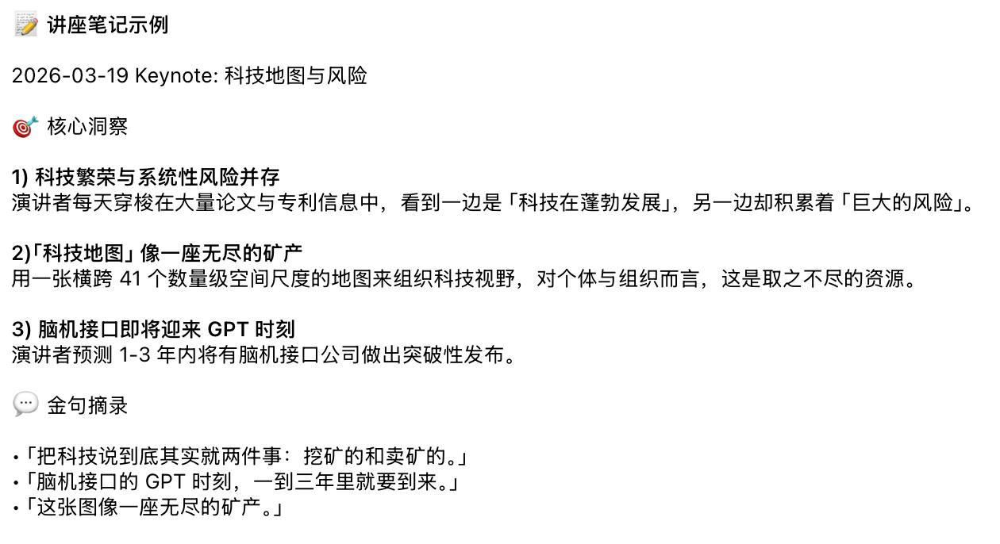
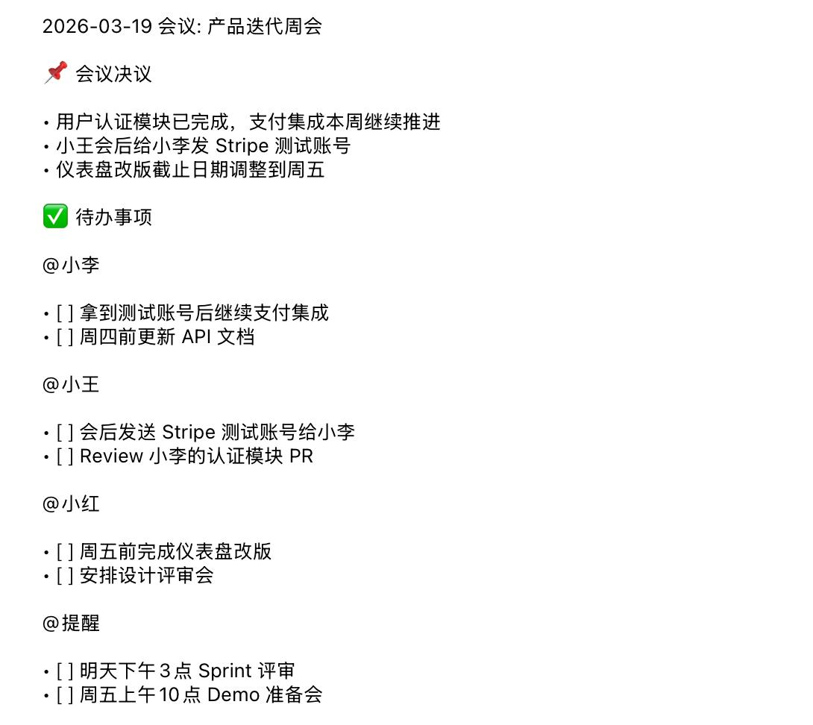

> **TL;DR**
> 
> Phone's built-in voice memo + OpenClaw = fully automated "record → transcribe → classify → structured notes."
> 
> - 💰 **Saves money**: $0 hardware + $0 subscription (vs competitors' $2000+ over 3 years)
> - 🔒 **Privacy**: 100% local data
> - 🧠 **Smart**: 7 recording types auto-detected, different templates for each
> - 🍎 **Apple-friendly**: iPhone recordings auto-sync to Mac for processing

## Recordings Shouldn't End Up Forgotten

Ever had this experience?

One-hour meeting, recording done, but:
- Never want to listen to it again
- Transcription is a wall of text, finding key points is exhausting
- "Who's responsible for this? What's the deadline?" Can't find it after searching forever
- Recording sits in your phone, never to be opened again

Heard an amazing talk:
- Thought "this is so insightful!" at the time
- Two days later, can't remember what it was about
- Want to find that quote? It's somewhere in the 45-minute recording

**Recording isn't the problem. Not having anyone organize it afterward is.**

## Current Solutions: Expensive, and Your Data Isn't Yours

DingTalk A1 ($70-110), Feishu Recorder ($125), Plaud Note (~$140 + **$240/year subscription**)...

These devices do AI transcription + smart summaries. But after researching, a few things stopped me:

**Yet another device.** Phone, power bank, earbuds... bag is cluttered enough. Add a recording card?

**Data lives in their cloud.** Your meetings, client conversations, interview recordings—all sitting on vendor servers.

**Subscription is really expensive.** Plaud at $240/year means $720 over three years—almost an iPhone.

**Ecosystem lock-in.** DingTalk recorder only works with DingTalk. Feishu's only with Feishu. Switch tools? Data doesn't come with you.

## My Solution: $0 Hardware + $0 Subscription + All Data Local

I built a fully automated flow with OpenClaw:

> **Phone recording → Auto-sync to computer → AI transcription → Smart type detection → Structured notes**

**If you're an Apple user**, you have a natural advantage: iPhone Voice Memos auto-sync to Mac. Record on the subway, open your laptop at home, notes are already generated.

**Not an Apple user?** Still works. Just specify your recording folder during first-time setup—like a OneDrive-synced directory.

## Key Feature: AI Knows What You Recorded

Regular AI transcription gives you a wall of text.

My system is different: **AI first determines what type of recording this is, then generates notes using the appropriate template.**

### 🎤 Meeting Recording → Action Items

Multi-person discussions with task assignments, AI generates:
- Meeting decisions (what consensus was reached)
- Action items (**grouped by person responsible**)
- Deadlines and reminders

**Never miss another "can you handle this?"**

### 🎓 Lecture Recording → Insights + Quotes

Listening to courses, podcasts, talks, AI generates:
- 3-5 core insights
- Notable quotes verbatim
- **No TODO list**

Why no TODOs? Lectures are for learning, not for task assignments. This matters—you don't want AI making up action items out of nowhere.

### 👔 Interview Recording → Evaluation Report

HR folks and interviewers, this one's for you:
- 5-dimension scoring: communication, expertise, logic, attitude, potential
- Each dimension gets a 1-5 score + specific comments
- Ready to archive or forward to hiring managers

### 📞 Client Communication → Commitment Tracking

Essential for sales, BD, customer success:
- Who promised what
- What's the deadline
- Where are the risks

**Never again "I think I promised the client something..."**

### 💡 Brainstorm → Ideas List

For divergent thinking sessions, AI will:
- Pull out every idea mentioned
- Tag each with feasibility and priority
- Catch every "what if we try..."

### 📝 Personal Notes → Organized Text

For those talking-to-yourself moments, AI will:
- Clean it up into readable text
- Strip out the "um," "like," "you know"
- Keep the meaning intact

## How Does AI Determine Type?

Four dimensions:

1. **People**: One person → notes/lecture, multiple discussing → meeting
2. **Pattern**: One-way output → lecture, Q&A → interview
3. **Content**: Has "deadline," "person responsible" → meeting, has "quote," "contract" → client
4. **Keywords**: Contains "candidate," "interview" → interview

If AI is uncertain, it asks for confirmation first. You can also set it to "trust AI judgment" for auto-processing.

## Real Results

### Example 1: Tech Talk

Recorded a 15-minute presentation, AI auto-generated:

**No action items. Lectures should be insights + quotes.**

### Example 2: Team Standup

Recorded an 8-minute English standup, AI auto-generated:

**Action items grouped by person—instantly see who's responsible for what.**

## 5-Minute First-Time Setup

First use, AI asks you a few questions:

After answering, config saves locally:

After that, it's fully automatic. Just record, notes generate themselves.

## Comparison with Voice Recorders

**Hardware Cost**
- Voice recorder: $70-140
- My solution: **$0** (use your phone)

**Annual Subscription**
- Plaud: $240
- My solution: **$0**

**Three-Year Total Cost**
- Plaud: $140 + $240×3 = **$860**
- My solution: **$0**

**Data Ownership**
- Voice recorder: Vendor's cloud
- My solution: **100% on your computer**

**Type Detection**
- Voice recorder: Generic template
- My solution: **7 specialized templates**

**Who Should Choose What?**

Choose voice recorder: Don't want to tinker, have budget, trust vendors

Choose my solution: Apple user, privacy-conscious, like being in control

## Code is Open Source

GitHub: **github.com/frxiaobei/frxiaobei-skills**

Directory: `skills/elyfinn-voice-notes/`

Includes: 7 type templates, classification logic, config system, documentation.

Give it a Star ⭐ if you find it useful. Got questions? Open an Issue.

---

A voice recorder isn't the real need.

**"Recording that automatically becomes usable notes" is the real need.**

5 minutes to configure, save $860, and data is completely yours.

Worth it? You decide.
