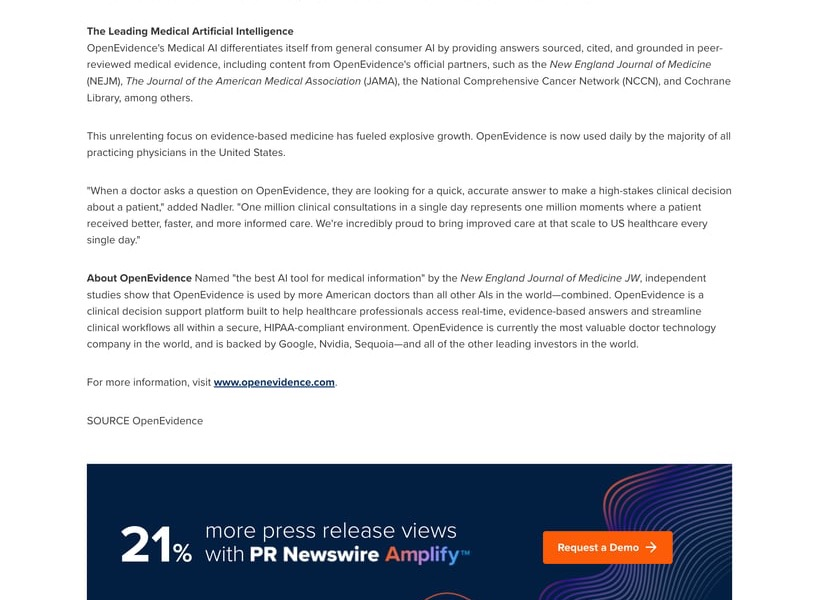

Just saw the news: OpenEvidence hit 1 million clinical consultations in a single day earlier this month.

The growth curve behind that number is even more striking:

- One year ago: 3 million consultations/month
- December 2025: 18 million/month
- Now: 1 million/day

40% of US physicians use it daily, across 10,000+ hospitals. In the past year, 100 million Americans were treated by doctors using OpenEvidence.

Valuation went 12x in one year: $1B → $3.5B → $6B → $12B.

From an industry perspective, the division of labor is shifting. No matter how you argue about barriers to entry, AI integrated into doctors' real workflows is happening.

## The Giants Are Piling In

No wonder OpenAI, Anthropic, Google, and Microsoft are all pushing into healthcare:

- OpenAI: $25B foundation commitment + "OpenAI for Healthcare"
- Anthropic: "Claude for Healthcare" + $30B Series G
- Google: Health 100 partnership with CVS, Verily just raised $300M
- Microsoft: $16B Nuance acquisition as foundation, 50 million health queries/day

This wave started hitting China late last year. The Chinese medical AI market is projected to grow from ¥8.8B in 2023 to ¥315.7B by 2033. Once data and compliance hurdles are cleared, real change could come faster than many expect.

## A Contrarian Take

Here's my somewhat contrarian view: **Medical AI won't necessarily be dominated by the largest models first.**

In fact, the first systems to truly ship might be carefully constrained small-model systems.

The macro narrative in AI for the past few years has been scaling laws—everyone assumes bigger models mean stronger capabilities, and stronger capabilities mean better fit for complex scenarios.

This holds in many domains, but healthcare is a bit different.

## Healthcare Is a Highly Constrained System

Think of healthcare as a highly constrained system.

Doctors aren't creative roles. Most spend their days making decisions within the bounds of clinical guidelines. This means AI just needs to be reliably correct to be valuable—it doesn't need to guess at every step using generalization. Guidelines themselves provide near-biblical guidance for agentic workflows.

Throwing the entire clinical decision chain at a single large model? Unstable and hard to verify.

But if you do it differently—small models for parsing and classification, retrieval augmentation, guidelines as constraints, all composed into an agentic workflow—the problem shifts from model capability to systems engineering.

Especially in hospital environments, look at the real constraints: low risk, strong compliance, explainability. Controllability often matters more than maximum capability.

## Two Paths Coexist

This is why we see two approaches running in parallel:

- OpenAI, Google, Qwen pushing toward large models + platform plays
- Other teams building more vertical, engineering-heavy systems

These are fundamentally different solutions.

My current framing: **Foundation models set the ceiling; harness determines if you ship.**

Yes, healthcare needs stricter harnesses. The importance of the latter is probably underestimated.

## Where's the Opportunity for Small Companies?

From this angle, this wave of medical AI isn't exclusively for big companies.

If you frame it as a model competition, then yes—no chance. Compute, data, and talent are concentrated at the giants.

But if the question becomes who understands specific scenarios better, and who can polish workflows to production-ready—the landscape looks completely different.

Healthcare is a classic knowledge + process + constraints industry.

Many critical capabilities are accumulated over years: clinical pathways, physician habits, departmental differences, historical data structures, compliance boundaries. Large models don't have these built-in.

What actually determines system effectiveness is who can structure this tacit knowledge.

This is why I think teams that have been deep in healthcare for years might actually have the edge in this wave—even if they're using off-the-shelf models.

Because all they need to do is embed models into systems that have been running for years. That barrier is a completely different skillset from training models.

If the earlier thesis holds—foundation models set the ceiling, harness determines if you ship—then this is exactly where small companies have their opening.

You don't need the strongest model. You need:

- Closer-to-the-ground scenario understanding
- More solid workflow design
- Longer-term data accumulation

Nail these three, and you can absolutely grow from a different path.

With so many open-source foundation models available, **this wave of medical AI can be a reshuffling of engineering capability + domain knowledge—not just a model race.**

---

**Follow Xiaobei for insights on AI deployment, startup opportunities, and tech analysis.**
