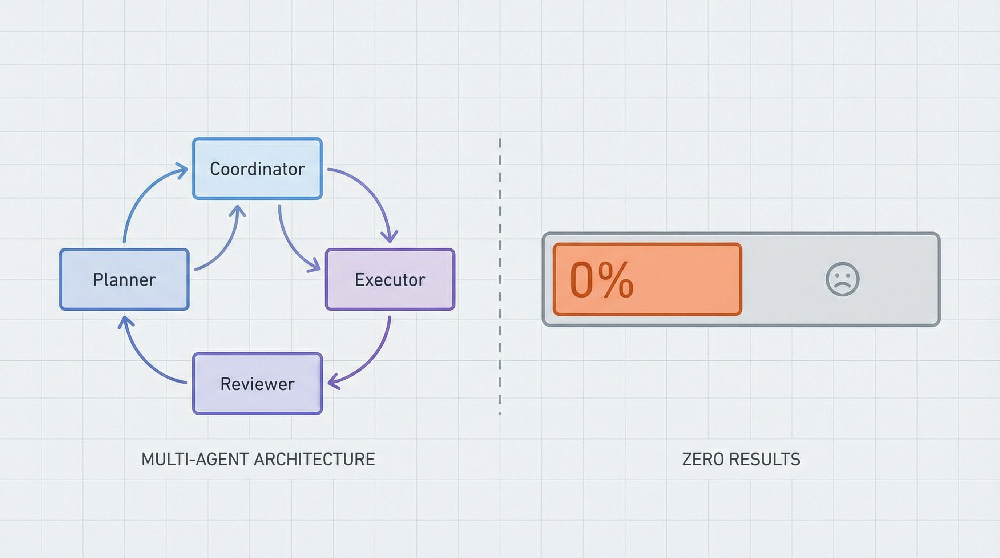
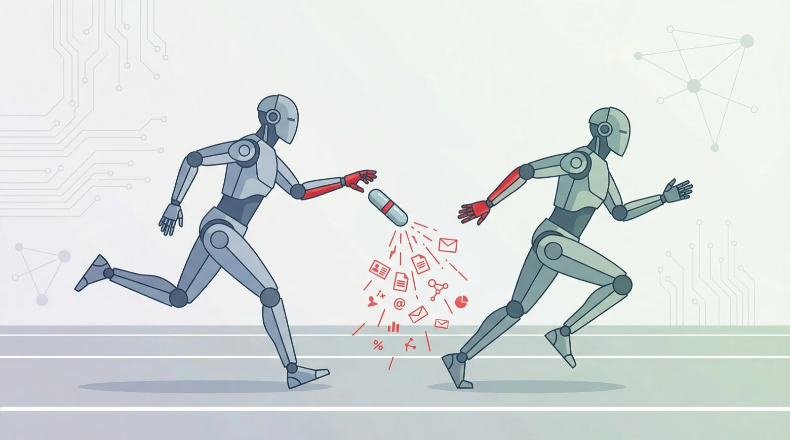
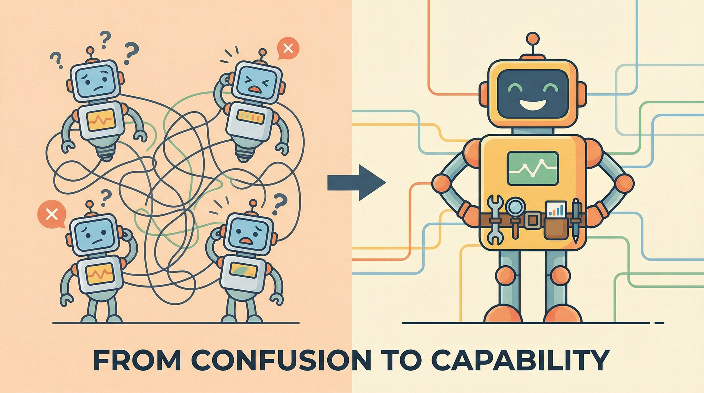

## 一个反直觉的观察

最近在 OpenClaw 社区里看到一个有趣的现象：很多人刚上手，就急着配置一堆 workspace。

架构图画得漂亮：

角色分工清晰、职责边界明确。然后呢？

每个 workspace 都空空如也，Coordinator 自己就能干完所有事。

这让我想起小时候老师说的：**差生文具多**。

---

## 不只是新手在犯错

你可能觉得这是新手问题。但不是。

前几天在 Reddit r/n8n 看到一个帖子。n8n 是 no-code 工作流平台，用户大多是有经验的开发者和自动化专家。帖子说：

> 「看到太多 5-6 个 specialized agents 互相协调的 workflow，打开一看，其实 3 个 node + 一个 agent 就能搞定。」

他举了个例子：有人搞了三个 agent，**email drafting**、**email sending**、**email followup tracking**。

明明一个 agent + 三个 tool 就能搞定的事，非要拆成三个 agent。

类似的声音也出现在大厂。GitHub 最近发了篇博客《Multi-agent workflows often fail》，复盘了他们在 Copilot 和内部自动化中踩过的坑：

> 「Most multi-agent failures come down to missing structure, not model capability.」

翻译一下：**多 agent 失败的主要原因不是模型能力不够，而是结构设计有问题。**

有意思的是，n8n 是 no-code 社区，用户大多是「够用就行」的实用主义者；GitHub 是大厂工程团队，讲究架构和最佳实践。两边的人背景完全不同，却在犯同样的错。

为什么？

**因为我们天生就爱把简单的事搞复杂。**

---

## 为什么我们爱过度设计？

### 复杂 = 专业？

人类有一个根深蒂固的直觉：**复杂的东西更厉害**。

四个 agent 分工明确，箭头指来指去，看起来比一个 agent 孤零零地干活「专业」多了。

但这是错觉。

画架构图很爽，你在创造，你在规划，你觉得自己在做「正确的工程实践」。

让一个 agent 真正跑通很痛苦，你要处理边界情况，你要调试奇怪的 bug，你要面对「为什么这么简单的事它都做不好」的灵魂拷问。

**差生为什么文具多？因为买文具比写作业容易，整理文具比解题愉快。**

### 分工的诱惑

1776 年，亚当·斯密在《国富论》里讲了针工厂的故事：十个工人分工合作，一天能生产 48,000 根针；一个人独立做，一天连 20 根都做不出来。

**专业化带来效率提升，这是经济学的基石。**

但斯密没告诉你的是：专业化也带来**协调成本**。

谁负责什么？怎么交接？出了问题谁来兜？

1937 年，经济学家罗纳德·科斯问了一个问题：如果市场分工这么有效，为什么还需要企业？

答案是：**交易成本**。在市场上找人、谈判、签合同、监督执行……这些成本加起来，可能比「直接雇一个人全干了」还高。

**企业的边界，取决于协调成本和分工收益的平衡点。**

AI Agent 也一样。

### 工具变了，边界也在变

有意思的是，最近几年我们看到一个趋势：**一人公司越来越多**。

一个人 + Vercel + Supabase + Stripe + ChatGPT，就能做出以前需要 10 个人才能做的产品。

为什么？因为**工具变好了**。

当一个人 + 好工具能干出三个人的活，你就不需要三个人了。不是因为三个人不好，而是因为**协调三个人的成本，可能比多干的活还高**。

OpenClaw 的 Skill 系统就是这个逻辑：

- **Skill** 是能力扩展：给 agent 装一个新工具
- **Agent** 是角色分裂：搞一个独立的脑子

查天气需要一个「天气 agent」吗？不需要，装个 `weather` skill 就行。

**大部分「专门化需求」，都可以用 skill 解决，不需要拆 agent。**

---

## 协调成本被严重低估

多 agent 的隐性成本：

- **上下文丢失**：Coordinator 知道的事，Researcher 不知道
- **格式对齐**：这边传 JSON，那边期待 Markdown
- **状态同步**：谁在干什么？干到哪了？
- **错误传播**：Researcher 出错了，怎么告诉 Coordinator？

一个 agent 内部，这些都是自动的。拆成多个 agent，**每一项都要显式处理**。

GitHub 那篇博客也提到，agent 之间会做很多 **implicit assumptions**，关于状态、顺序、格式。这些隐式假设一旦出错，整个系统就崩了。

---

## 我们的教训

说说我们自己。

最开始，我们也兴冲冲地搞了多 workspace 配置。四个角色，四套 bot，配置花了一天。

跑了两周，发现：

- 搜信息？main 直接用 `web_search` 就行
- 深度分析？main 加载分析 skill 也能做
- 执行任务？main 调用各种 tool 就完事了

**真正需要独立 agent 的场景只有一个：并行写代码。**

比如做一个网站项目，让 Codex 写前端、Claude Code 写后端，两个同时跑。这才是「真的需要多 agent」。

### 一个具体的例子

最近做一个网站，有 8 个前端任务。

**方案 A：一个 Codex 顺序做**
- 耗时：4 小时
- 协调成本：0

**方案 B：8 个 Codex 并行做**
- 耗时：30 分钟
- 协调成本：合并冲突、样式不一致、组件重复

我们选了方案 A。

什么时候用方案 B？后端 + 前端对接时，两个 Agent 并行才有意义，因为互相等待是浪费。

**教训：拆早了 = 增加协调成本 + 没有收益。**

---

## 如果真的要拆

不是说永远不拆，而是**等遇到瓶颈再拆**。

### 什么时候真的需要？

- **真正的并行**：两个任务同时跑，互不依赖
- **硬隔离需求**：不同权限、不同上下文
- **上下文爆炸**：单 agent 的 context window 真的不够用

### 拆了之后要做的事

如果你真的决定拆，准备好这些：

**1. 显式交接清单**

每次交接必须明确：输出格式、语气目标、上下文、完成标准。不要假设对方「应该知道」。

**2. 三份日志**

- **行动日志**：做了什么
- **拒绝日志**：为什么没做（最容易被忽略，但最有价值）
- **交接日志**：传给谁、传了什么

拒绝日志尤其重要，「为什么没做」往往是隐形工作，没人看到，但如果没做，系统就会出问题。

**3. near-miss 摘要**

定期统计「差点出事但被兜住」的事件。这些数据让协调价值可量化，避免协调者被低估、资源被砍、系统崩溃。

---

## 正确的顺序

1. **先让一个 workspace 真正 work**
   - 能完成日常任务
   - 能处理边界情况
   - 能稳定产出

2. **用 Skills 扩展能力**
   - 需要新能力？装 skill
   - 不需要新角色

3. **遇到瓶颈再考虑拆**
   - 单 agent 响应太慢 → 考虑并行
   - 上下文太长 → 考虑拆分
   - 权限需要隔离 → 考虑独立 workspace

**不要跳过 1、2，直接去做 3。**

---

## 科斯的问题

回到科斯的问题：企业的边界在哪里？

答案是：**当内部协调成本 = 外部交易成本时**。

AI Agent 的边界也一样。

当「拆成多个 Agent 的收益」 > 「协调成本」，才值得拆。

否则，就是差生文具多。

---

## 留给你的问题

在你急着配置第二个 workspace 之前，问自己：

1. **一个 workspace + skills 真的做不到吗？**
2. **拆了之后，协调成本你准备好了吗？**
3. **你是在解决问题，还是在享受「设计复杂系统」的快感？**

**能不拆就不拆。要拆就等遇到真瓶颈。**

---

**关注「凡人小北」**，一起探索 AI Agent 的正确打开方式。

下一篇预告：《OpenClaw 记忆分层：你的 Agent 不需要记住一切》
