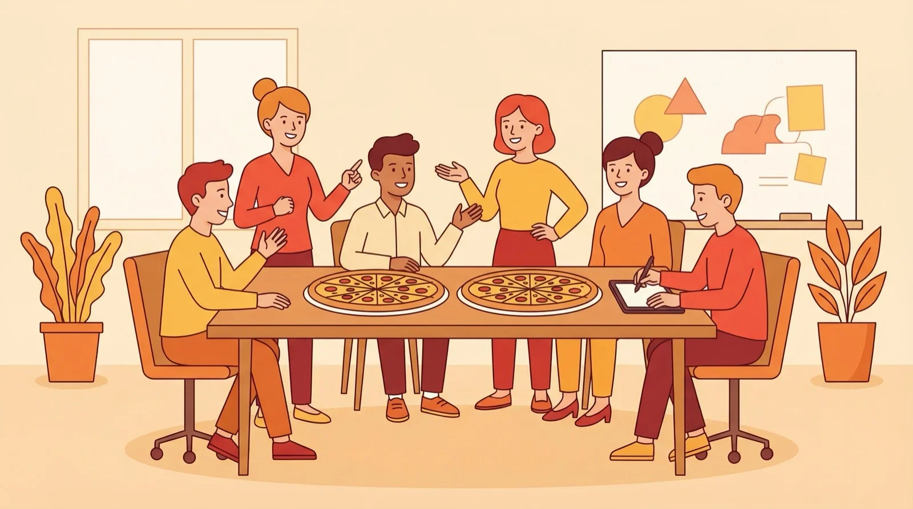
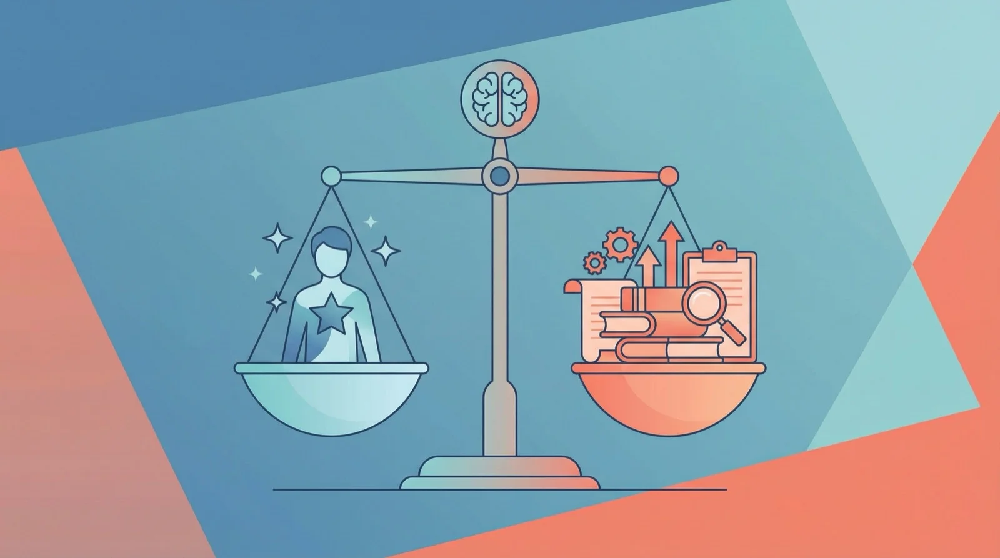
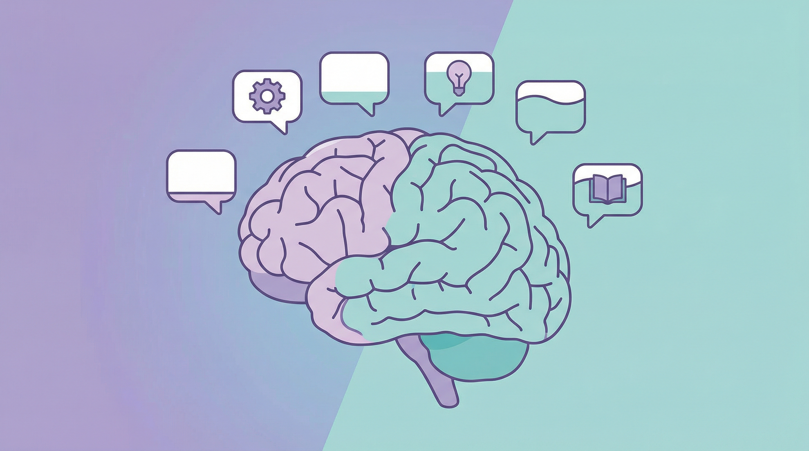

上篇「差生文具多」聊了一个现象：很多人一上来就搞 4 个 Workspace，结果每个都空着。

写完之后我发现，这不只是 OpenClaw 的问题。

**OpenClaw 的每个配置概念，都能映射到一个管理学原理。**

理解这些映射，既能帮你用好 OpenClaw，也能让你重新思考「管理」这件事。

---

## 一张映射表

先上结论：

**OpenClaw → 管理学**

- **Workspace** → 部门（边界在哪？）
- **Agent** → 员工（专才还是通才？）
- **Skill** → 技能培训（培训还是招人？）
- **Memory** → 知识库（什么该记？）
- **Context Window** → 认知负荷（信息多少合适？）
- **Cron** → 流程自动化（什么该自动？）
- **Handoff** → 交接（怎么减少出错？）

下面一个一个聊。

---

## Workspace = 部门

这个在「差生文具多」里聊过了，核心是科斯的问题：

**部门的边界在哪里？**

答案是：当内部协调成本 = 外部交易成本时。

Jeff Bezos 有个著名的「两块披萨」规则：**一个团队应该小到两块披萨能喂饱**，大概 5-10 个人。

为什么？因为随着团队变大，沟通链路呈指数增长。10 个人的团队有 45 条沟通链路，20 个人就变成 190 条。协调成本会吃掉专业化带来的收益。

Amazon 的做法是把自己变成「一支小团队组成的舰队」，而不是一个庞大的官僚机构。每个 Two-Pizza Team 有清晰的职责边界，独立决策，减少跨团队协调。

翻译成 OpenClaw 语言：

- 拆 Workspace 的收益 > 协调成本 → 拆
- 拆 Workspace 的收益 < 协调成本 → 不拆

大部分人的问题是**拆太早**。还没遇到瓶颈，就急着搞多 Workspace。

就像公司还没到 10 个人，就急着分部门、定流程、搞 OKR。

**结果是：协调成本大于产出。**

---

## Skill vs Agent = 培训 vs 招人

这是一个很实际的管理问题：

**遇到新需求，是培训现有员工，还是招一个新人？**

Netflix 的文化手册里有句著名的话：

> 「Adequate performance gets a generous severance package.」
> 
> 平庸的表现会得到一笔丰厚的遣散费。

听起来残酷，但背后的逻辑是：**Netflix 不相信培训能把 B-player 变成 A-player**。他们宁愿花精力找到合适的人，而不是试图改变不合适的人。

他们还有个「Keeper Test」：如果一个员工说要离职，你会不会拼命挽留？如果答案是不会，那现在就该让他走。

在 OpenClaw 里：

- 给现有 Agent 装 Skill = 培训
- 新建一个 Agent = 招人

**什么时候「培训」（装 Skill）**：

- 新能力和现有工作相关
- 不需要独立的上下文
- 一个人能顾得过来

**什么时候「招人」（新 Agent）**：

- 需要并行处理
- 需要硬隔离（比如权限不同）
- 单人认知负荷已经爆了

大部分情况下，**装 Skill 比新建 Agent 成本低**。

但如果你发现一个 Agent 加了十几个 Skill 还是做不好，可能问题不在 Skill，而是这个任务本来就需要一个专门的 Agent。

这就是 Netflix 的逻辑：**先确保人对，再谈能力扩展**。

---

## Memory = 知识管理

公司有各种知识：核心价值观、产品文档、会议纪要、项目细节……

**问题是：什么该放全局知识库？什么该放项目文档？什么干脆别记？**

OpenClaw 的 Memory 层级给了一个很好的参考：

**Memory 层级 → 公司知识库**

- **MEMORY.md** → 核心价值观、长期战略（很少变，全员需要知道）
- **memory/daily** → 会议纪要、日报（时效性强，过期就没用）
- **PROJECT.md** → 项目文档（项目相关方需要，其他人不需要）
- **Skill** → SOP、操作手册（执行时加载，平时不占脑子）

**核心原则**：

1. **不是所有东西都要放全局**。人记不住所有细节，Agent 也记不住。
2. **需要的时候能找到就行**。不用全放脑子里，放对地方、建好索引。
3. **过期的要清理**。不然噪音会淹没信号。

这也是为什么「记忆分层」会是这个系列的下一篇。

---

## Context Window = 认知负荷

这是一个被严重低估的概念。

1956 年，心理学家 George Miller 发表了一篇著名论文：「神奇的数字 7±2」。他发现人类的工作记忆只能同时处理大约 7 个「chunks」的信息。后来的研究认为这个数字可能更小，大概只有 4 个。

**这就是为什么会议人太多没人认真听，邮件抄送太多没人认真看。**

OpenClaw 的 Context Window 也有上限，塞太多东西进去，Agent 反而会变迷糊。

信息塞太多，反而什么都抓不住。

OpenClaw 的做法是「渐进式加载」：

1. 先加载 Skill 的 description（几十个字）
2. 需要用再加载 SKILL.md（几百行）
3. 需要细节再加载 references/（更多）

这就是「Need to know」原则：

- 先给摘要
- 需要再展开
- 不需要就不加载

---

## Cron = 流程自动化

什么该自动化？什么该人工？

这是每个管理者都要回答的问题。

**适合自动化的**：

- 重复性高（每天都做一样的事）
- 规则明确（没有灰色地带）
- 错误成本低（错了能补救）

**不适合自动化的**：

- 需要判断（要看具体情况）
- 例外情况多（总有意外）
- 错误成本高（错了很麻烦）

OpenClaw 的 Cron 就是按这个逻辑设计的：

**适合自动化**：

- ✅ 每日天气播报（规则明确，错了无所谓）
- ✅ 定时备份（重复性高，必须可靠）

**不适合自动化**：

- ❌ 发布文章（需要人审核，错误成本高）
- ❌ 回复客户（需要判断，情况多变）

**自动化不是目的，减少不必要的人工才是。**

---

## Handoff = 交接

这是多 Agent（多人协作）最容易出问题的地方。

上篇提过：**交接是错误倍增的地方。**

为什么？

- 信息丢失（A 知道的，B 不知道）
- 格式不对（A 给 JSON，B 要 Markdown）
- 假设不同（A 以为 B 知道，B 以为 A 会说）

**解决方案是让交接显式化**：

1. **交接清单**：每次交接明确写清楚输出格式、上下文、完成标准

2. **三份日志**：
   - 行动日志：做了什么
   - 拒绝日志：为什么没做
   - 交接日志：传给谁、传了什么

这在公司里也一样：

- 项目交接要有文档
- 离职交接要有清单
- 跨部门协作要有明确的接口

**「我以为你知道」是协作失败的头号杀手。**

---

## 一个统一的视角

回头看这张映射表，会发现一个共同主题：

**管理的本质是在有限资源下做协调。**

**资源 → OpenClaw → 公司**

- **注意力** → Context Window → 员工的认知负荷
- **预算** → Token / API 成本 → 人力 / 时间成本
- **协调代价** → 多 Agent 通信 → 跨部门会议

OpenClaw 迫使你思考这些问题：

- 这个 Workspace 真的需要吗？（部门边界）
- 装 Skill 还是新建 Agent？（培训还是招人）
- 什么放 Memory？（知识管理）
- Context 塞多少？（信息过载）
- 什么该自动？（流程设计）
- 交接怎么做？（协作规范）

**配置 OpenClaw 的直觉，就是管理的直觉。**

---

## 写在最后

这不是说 OpenClaw 发明了什么新理论。

而是说，软件设计和组织设计面临的是同一类问题：

**如何在有限资源下，让多个实体高效协作？**

1937 年科斯问「企业为什么存在」，答案是交易成本。

2026 年我们在配置 OpenClaw，面对的是同一个问题：

**协调成本和专业化收益的平衡。**

理解了这一层，你就不只是在「配置软件」，而是在「设计组织」。

---

**关注「凡人小北」**，一起探索 AI Agent 的正确打开方式。

上一篇：「OpenClaw 差生文具多：你可能不需要 4 个 Workspace」
下一篇：「OpenClaw 记忆分层：你的 Agent 不需要记住一切」
