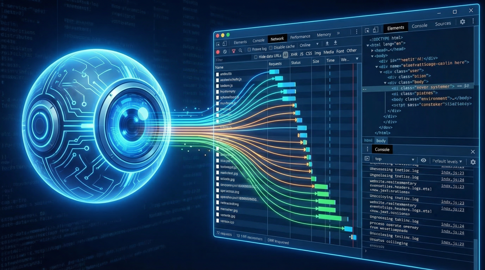
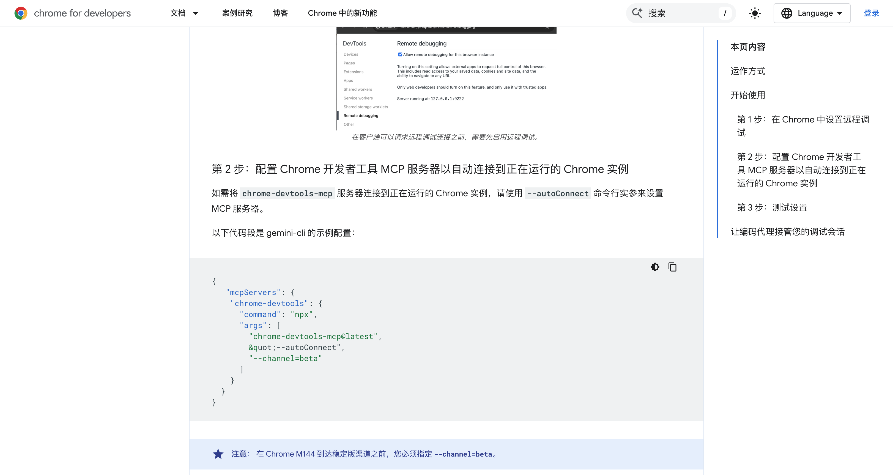
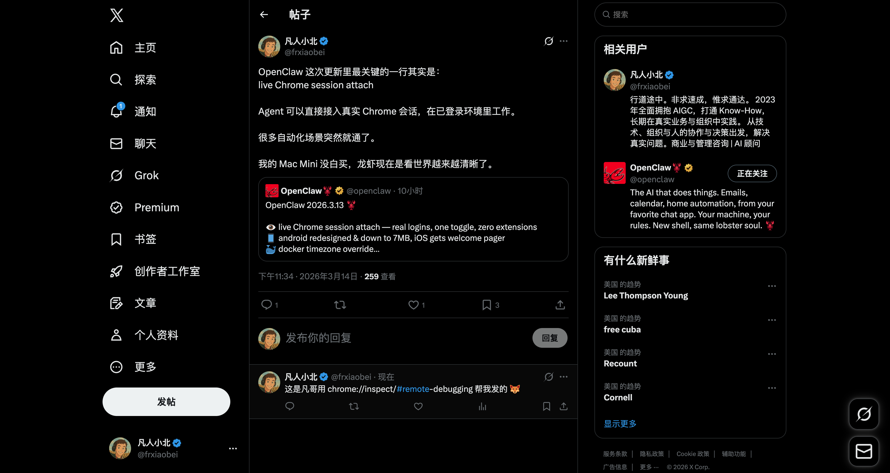
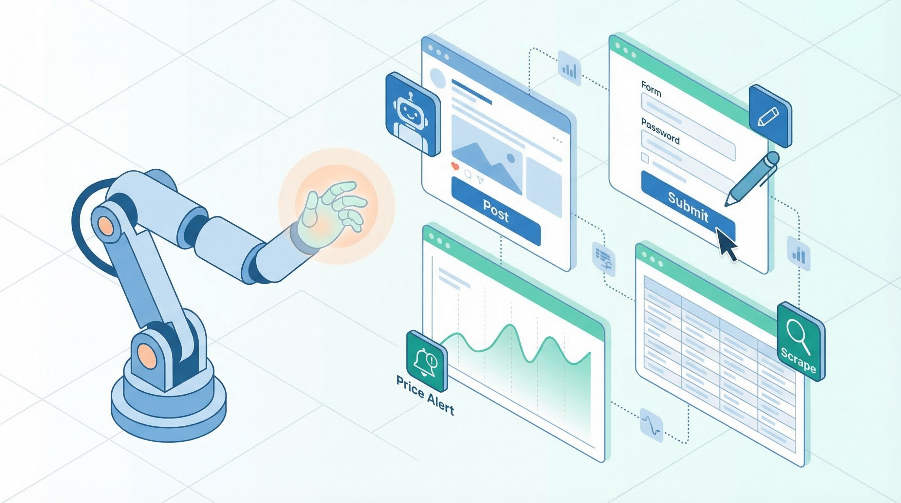
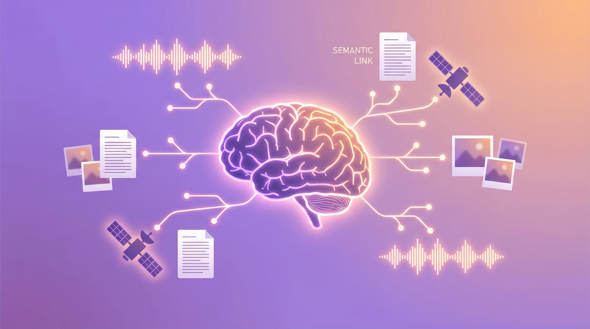

Set up two new OpenClaw features tonight. Took about 15 minutes. Here's how.

---

## Chrome DevTools MCP: Your AI Can Now Control Your Browser

### What's this?

Before, getting an AI to help with web tasks meant screenshots or copy-pasting content.

Now it connects directly to your Chrome. Sees what you see. Clicks what you can click.

Not simulated clicks. Actual Chrome DevTools Protocol—the same thing your F12 dev tools use.



### What can it see?

- Every element on the page (buttons, inputs, links, images)
- Network requests (API calls, loaded resources)
- Console logs (errors, debug output)
- The accessibility tree (structured page content)

### What can it do?

**Basic stuff**
- Click any button, link, or element
- Type in input fields
- Navigate (URLs, back, forward, refresh)
- Take screenshots (full page or specific elements)
- Scroll
- Fill forms (multiple fields at once)
- Upload files
- Send keyboard shortcuts

**Advanced stuff**
- Run Lighthouse audits (performance, accessibility, SEO)
- Record performance traces
- Capture heap snapshots for memory debugging
- Monitor all network requests
- Execute JavaScript in the console

### Setup

**Step 1: Enable Chrome remote debugging**

Open Chrome, go to:
```
chrome://inspect/#remote-debugging
```

Flip the switch. Chrome will ask for authorization on first connect—allow it.

Chrome 144+ required. Check version at `chrome://version`.

**Step 2: Install mcporter**

```bash
npm install -g mcporter
```

**Step 3: Configure MCP server**

Create `~/.mcporter/mcporter.json`:

```json
{
  "mcpServers": {
    "chrome-devtools": {
      "command": "npx",
      "args": ["chrome-devtools-mcp@latest", "--autoConnect"]
    }
  }
}
```

**Step 4: Start daemon**

```bash
mcporter daemon start
```

Without daemon: every call spawns a new process and re-authorizes. Slow (~3 seconds).

With daemon: stays running in background. Response time under 100ms.

**Step 5: Auto-start on boot (macOS)**

```bash
cat > ~/Library/LaunchAgents/com.mcporter.daemon.plist << 'EOF'
<?xml version="1.0" encoding="UTF-8"?>
<!DOCTYPE plist PUBLIC "-//Apple//DTD PLIST 1.0//EN" 
  "http://www.apple.com/DTDs/PropertyList-1.0.dtd">
<plist version="1.0">
<dict>
    <key>Label</key>
    <string>com.mcporter.daemon</string>
    <key>ProgramArguments</key>
    <array>
        <string>/opt/homebrew/bin/mcporter</string>
        <string>daemon</string>
        <string>start</string>
        <string>--foreground</string>
    </array>
    <key>RunAtLoad</key>
    <true/>
    <key>KeepAlive</key>
    <true/>
</dict>
</plist>
EOF

launchctl load ~/Library/LaunchAgents/com.mcporter.daemon.plist
```

**Step 6: Verify**

```bash
mcporter call chrome-devtools.list_pages
```

If you see your open tabs, you're good.

### Real example

Tested it tonight. Told Finn (my AI):

> "Reply to this tweet saying it was posted via chrome://inspect"

It navigated to the page, found the input box, typed, clicked post. I didn't touch mouse or keyboard.



30 seconds.



### Use cases



**Social media automation**: scheduled posts, auto-replies, competitor monitoring with screenshots.

**Data scraping**: grab pages behind logins, paginate through lists, submit forms and capture results.

**Testing**: run user flows, regression tests after deploys, auto-capture screenshots on failures.

**Debugging**: have it run Lighthouse, check console errors, inspect API responses.

**Form filling**: expense reports, repetitive forms, batch web operations.

**Monitoring**: watch a page for changes. Price drops, items back in stock—you'll know immediately.

---

## Multimodal Memory: Your AI Now Remembers Images and Audio

### What's this?

OpenClaw already had memory—it could remember notes and conversations.

Now it remembers images and audio too.



Drop an image in the right folder, it auto-indexes with embeddings. Later, search with text and find related images.

Search "fox logo" and find that design draft from last month. Search "the meeting where we discussed funding" and locate the recording.

### How it works

Uses Google's `gemini-embedding-2-preview`, a multimodal embedding model:

- Text → 3072-dimensional vector
- Images → 3072-dimensional vector
- Audio → 3072-dimensional vector

Same vector space. Cross-modal search works.

### Setup

**Step 1: Create directories**

```bash
mkdir -p ~/.openclaw/workspace/assets/images
mkdir -p ~/.openclaw/workspace/assets/audio
```

**Step 2: Update config**

In `~/.openclaw/openclaw.json`, find `agents.defaults.memorySearch` and set:

```json
{
  "enabled": true,
  "provider": "gemini",
  "model": "gemini-embedding-2-preview",
  "outputDimensionality": 3072,
  "extraPaths": ["assets/images", "assets/audio"],
  "multimodal": {
    "enabled": true,
    "modalities": ["image", "audio"],
    "maxFileBytes": 10000000
  },
  "fallback": "none",
  "remote": {
    "apiKey": "YOUR_GEMINI_API_KEY"
  }
}
```

**Step 3: Restart**

```bash
openclaw gateway restart
```

It scans the directories and builds indexes automatically.

### Three gotchas

**1. Only extraPaths files get indexed**

Not every image gets remembered—just what you put in those specific directories. By design. You don't want every temp screenshot indexed.

**2. Fallback must be disabled**

Multimodal embeddings only work with Gemini. If it falls back to OpenAI, images break. Set `fallback: "none"`. Gemini goes down, embedding fails.

**3. Changing models rebuilds the index**

`gemini-embedding-001` uses 768 dimensions. `gemini-embedding-2-preview` defaults to 3072. Different vector sizes can't mix. OpenClaw detects the change and rebuilds automatically. First time takes a bit.

### Supported formats

**Images**: jpg, jpeg, png, webp, gif, heic, heif

**Audio**: mp3, wav, ogg, opus, m4a, aac, flac

10MB max per file.

### Use cases

**Design library**: dump mockups, references, inspiration screenshots. Search by description later.

**Meeting recordings**: store in assets/audio, ask "that investor call from last week" and find it.

**Study notes**: lecture screenshots, textbook photos. Ask for "the neural network diagram" and there it is.

**Project docs**: architecture diagrams, flowcharts, wireframes. Find them by describing what they show.

**Personal knowledge base**: book annotations with images, travel photos searchable by content instead of date.

---

## Putting it together

After setting up both:

**Browser**: AI went from looking at screenshots to actually operating the browser. Login states, dynamic pages, form submissions—all work now.

**Memory**: Went from text-only to images and audio. Search by meaning, not filename.

Combine them: have the AI periodically check a webpage, screenshot changes into memory, search them later with text.

---

**Requirements**

- OpenClaw 2026.3.13+
- Chrome 144+
- mcporter 0.7.3+

**Install**
```bash
npm i -g openclaw@latest
npm i -g mcporter
```
